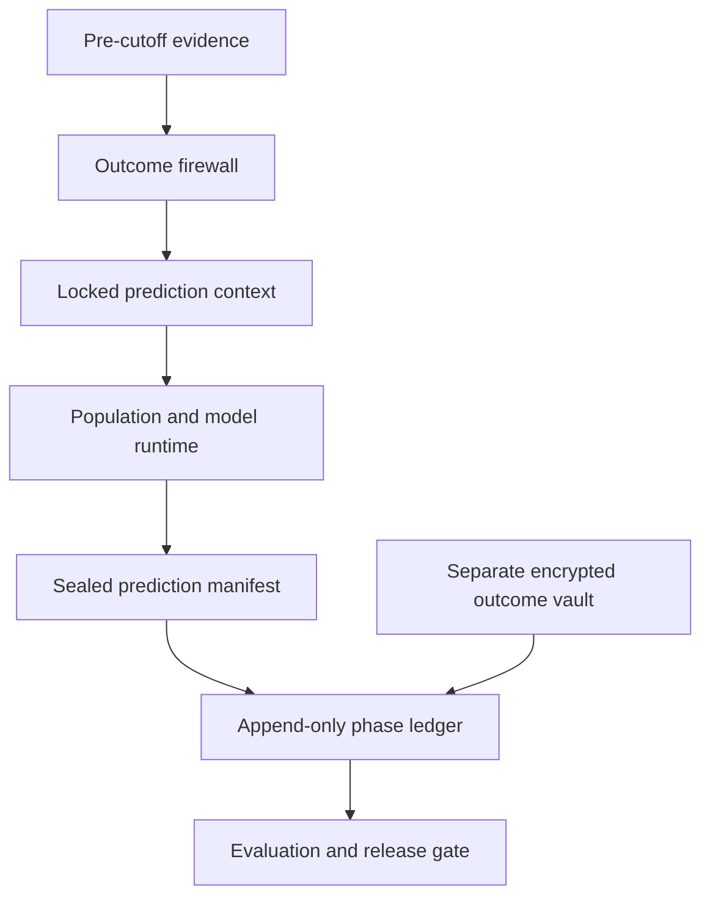

# Rival

Rival is an evidence-gated population and behavior simulation product. It combines calibrated synthetic responses with a small human anchor, exposes the result through a study API and interface, and keeps prediction claims tied to reproducible qualification artifacts.

Version 0.4 keeps the real-data qualification from v0.2 and adds the prospective-integrity kernel needed to run a defensible customer study: an outcome-free prediction boundary, deterministic provider/request identity, sealed preregistration manifests, an append-only phase chain, and a separate encrypted outcome vault. It makes a bounded launch claim: population-distribution calibration is ready for controlled pilots; universal or reliable individual prediction is not claimed.

## Real-data results

| Track | Data | Baseline | Rival result | Decision |
|---|---:|---:|---:|---|
| OpinionQA population distributions | 489 Pew questions × 2,058 released personas | 0.331 unweighted-persona TVD; 0.227 global-history TVD | **0.169 mean TVD** | Bounded pilots |
| OpinionQA question win rate | 489 family-held-out questions | — | **85.1% improved** | Supporting evidence |
| Twin-2K categorical individual prediction | 2,058 people × 108 categorical items | 52.8% population-mode accuracy | 54.1% released-LLM accuracy; **44.0% novel transfer** | Research only |
| Twin-2K human reliability | same panel | — | 68.6% test–retest accuracy | Ceiling/context |
| Twin-2K 80-person anchor | 108 categorical items | 0.279 raw model TVD | **0.074 hybrid TVD** | Bias correction works; human-only remains stronger here |

OpinionQA is evaluated with five out-of-fold splits at the canonical/TF-IDF question-family level. Calibration reduces error 48.8% versus unweighted personas and 25.3% versus a classical global-history distribution, beating the latter on 71.6% of questions. Twin-2K transfer removes the target item, same QuestionID, normalized experimental block, and known semantic siblings from the donor matrix. Wave-4 outcomes never train that transfer model. Full per-question results, source hashes, limitations, and split-manifest hashes are in `reports/`.

## Product capabilities

- weighted seed populations calibrated to multiple target marginals;
- family-held-out persona-mixture calibration adapted from SYN-DIGITS;
- real OpinionQA and Twin-2K loaders with aligned schemas and SHA-256 provenance;
- question-family leakage firewall with deterministic fold manifests;
- longitudinal baselines: population mode/median, human test–retest, released LLM, and target-family-excluded ridge transfer;
- prediction-powered categorical correction with a held-out human anchor;
- TVD, Jensen–Shannon, percentage-point, rank, individual accuracy, normalized MAE, and correlation metrics;
- confidence/abstention policy and append-only SQLite evidence ledger;
- OpenAI-compatible behavior-provider adapter;
- deterministic `PredictionContext` binding the scenario, eligible population, targets, retrieval audit, provider/model configuration, code version, and information cutoff;
- fail-closed outcome firewall with per-person retrieval inclusion/exclusion hashes;
- provider call identity covering model, endpoint fingerprint, request hash, cache key, attempts, latency, and upstream request ID without retaining credentials;
- HMAC-SHA256 deployment seals over immutable prediction/preregistration manifests;
- explicit `draft → prediction_locked → outcomes_revealed → evaluated` hash chain;
- AES-GCM outcome vault in a separate database, with manifest binding, time-gated reveal, authenticated decryption, and access events;
- local REST API, study workflow, and evidence/validation dashboard;
- complete CLI qualification pipeline and machine-readable reports.

## Install and run

Rival requires Python 3.11+.

```bash
cd rival
python3 -m pip install -e .
python3 -m unittest discover -s tests -v
python3 -m rival qualify-integrity
python3 -m rival qualify-all --output-dir reports
python3 -m rival verify-release
python3 -m rival serve --port 8080
```

Open `http://127.0.0.1:8080`, then select **Validation** to inspect the bundled release gate.

Individual tracks can be reproduced directly:

```bash
python3 -m rival qualify-opinionqa \
  --folds 5 --iterations 150 \
  --output reports/opinionqa_qualification.json

python3 -m rival qualify-twin2k \
  --ridge-alpha 10 --anchor-size 80 \
  --output reports/twin2k_qualification.json

python3 -m rival qualify-integrity \
  --output reports/integrity_qualification.json
```

The original offline concept-test slice remains available:

```bash
python3 -m rival demo
python3 -m rival demo --json reports/demo.json --markdown reports/demo.md
```

## Use a real model provider

The adapter accepts an OpenAI-compatible chat-completions endpoint and requests a strict probability distribution instead of unconstrained role-play.

```python
import os

from rival.engine import RivalEngine
from rival.providers import OpenAICompatibleProvider

engine = RivalEngine()
engine.register_provider(
    "behavior-api",
    OpenAICompatibleProvider(
        model="your-authorized-model",
        api_key=os.environ["RIVAL_API_KEY"],
        base_url="https://your-endpoint.example/v1/chat/completions",
    ),
)
```

Set `scenario.model_family` to `behavior-api`. Credentials are read from the environment and are never stored in identities, contexts, runs, manifests, or reports. The public qualification numbers use released upstream model outputs because no external provider credential was configured during that benchmark.

## Prospective study workflow

1. Prepare a prediction context with `/api/prediction-context`. Any protected outcome field fails closed; history after `information_cutoff` is excluded and hashed in the audit.
2. Submit the returned `locked_context` with `/api/simulate`. Rival recomputes the context and stops before provider calls if any input, retrieval rule, provider configuration, or code version changed.
3. Configure `RIVAL_MANIFEST_KEY` with at least 32 bytes and call `/api/studies/lock` with the unchanged ledger-backed simulation plus preregistered metrics and thresholds.
4. Deposit future outcomes through `OutcomeVault` using separate storage and key custody. The simulation server intentionally has no outcome-reveal endpoint.
5. After the declared availability time, reveal the outcome in a separate evaluation process, append the reveal receipt, evaluate, and close the phase chain.

The manifest seal is a symmetric deployment seal, not a public-key signature or third-party timestamp. For a customer study, keep manifest and outcome keys outside the model team's credentials and export the sealed manifest to an independent custodian before outcome collection.

## API

| Method | Endpoint | Purpose |
|---|---|---|
| GET | `/api/health` | Service status and providers |
| GET | `/api/qualification` | Bundled real-data release summary |
| GET | `/api/demo/config` | Demo scenario schema |
| POST | `/api/demo/run` | Population → simulation → anchor → correction demo |
| POST | `/api/prediction-context` | Audit and hash the exact outcome-free prediction boundary |
| POST | `/api/simulate` | Run a supplied population, targets, and scenario |
| POST | `/api/studies/lock` | Seal a ledger-backed run and preregistration; requires `RIVAL_MANIFEST_KEY` |
| POST | `/api/hybrid` | Correct a simulation with human observations |
| GET | `/api/runs` | Recent immutable run records |

## Architecture



See `docs/ARCHITECTURE.md`, `docs/PROSPECTIVE_STUDIES.md`, `docs/VALIDATION_PROTOCOL.md`, and `docs/UPSTREAM_INTEGRATION.md`. Source and data attribution is in `THIRD_PARTY_NOTICES.md`; exact incorporated file hashes are in `upstreams.lock.json`.

## Honest release scope

Rival v0.4 has a reproducible aggregate-distribution result on one five-choice survey domain and verified engineering controls for running a prospective study. Those controls prevent common leakage and tampering paths; they do not themselves establish predictive validity. Rival still does not prove transfer to customer concepts, future behavior, open-ended responses, interventions, or interactive multi-agent settings. The Twin-2K negative transfer result is intentionally shipped: a plausible research method failed to beat a classical population baseline, so individual novel-question prediction stays behind the research gate.

The next commercial milestone is a protected, prospective pilot with customer-owned outcomes, a relevant classical model, an equal-cost human baseline, preregistered thresholds, and misses retained.
